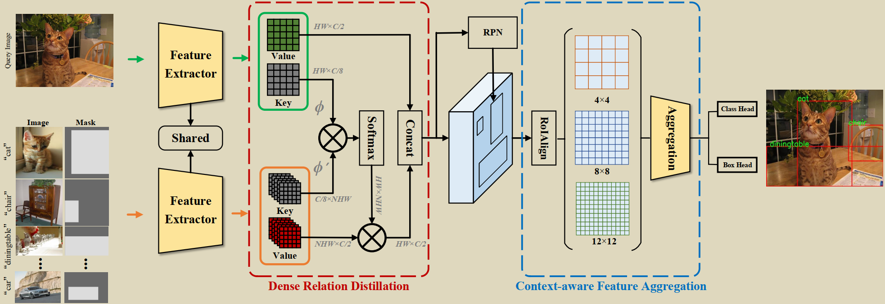
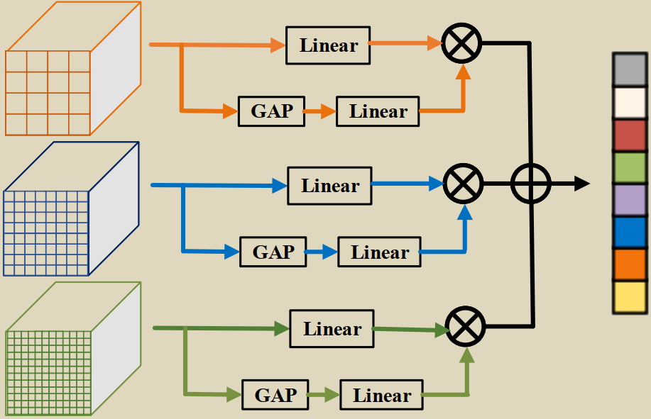
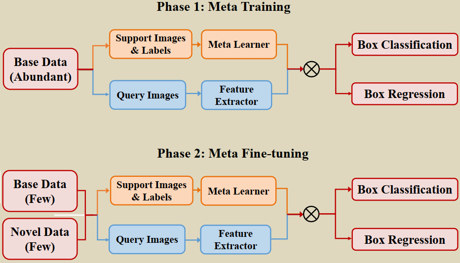

# Dense Relation Distillation with Context-aware Aggregation for Few-Shot Object Detection

## 前期阅读

### 粗读

**主解决的问题**：标注样本的成本很大且难，数据集对某些特征天然的缺失，数据集过拟合不能泛化。

**提出或应用的新方法**：1）提出了一个解决少样本目标检测问题的模块：dense relation distillation——旨在充分利用支持信息来辅助新类对象的检测过程。2）提出了一个更好的捕获全局和局部特征的模块：adaptive context-aware feature aggregation——以缓解尺度变化问题。

**最终达到的结果**：引用原文的表述：“Extensive experiments illustrate that our approach has  achieved a consistent improvement on PASCAL VOC  and MS COCO datasets. Specially, our approach  achieves better performance than the state-of-the-art  methods on the two datasets.”

### 精读

DCNet 的整体框架：

1. 采用 Faster R-CNN 作为基础检测器；

2. 采用了匹配机制；

3. 与 Meta R-CNN 相类似的基于 meta-learning 的架构。

Fig2. DCNet 的整体架构。

#### Dense Relation Distillation (DRD) 模块

Key and Value Embedding

Relation Distillation

#### Context-aware Feature Aggregation (CFA) 模块

 Fig3. 采用注意力机制以自适应聚合不同的特征。

#### Meta-learning 策略

Fig4. 基于 meta-learning 的学习策略。

如上图所示训练过程包含两个阶段：1）meta training：提供大量带有注释的基类数据，联合训练特征提取器、DRD模块、CFA模块和其他检测模型的基础部分。2）meta fine-tuning：提供少量的基类和新类数据，新类只有 k 个带标签的 bounding-boxes 可用，为了平衡基类和新类的样本，为每个基类包括 k 个 boxes。

## 后期阅读

中心思想：

论文写作架构：

对该论文的评价：