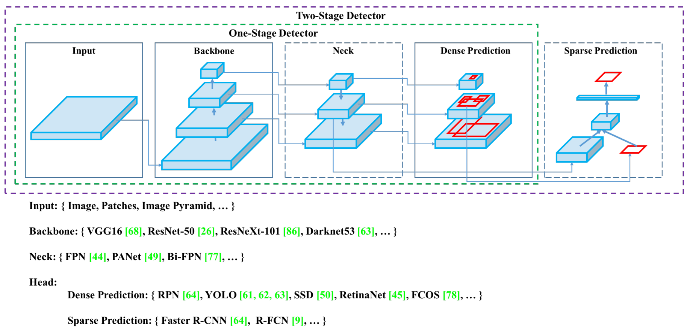
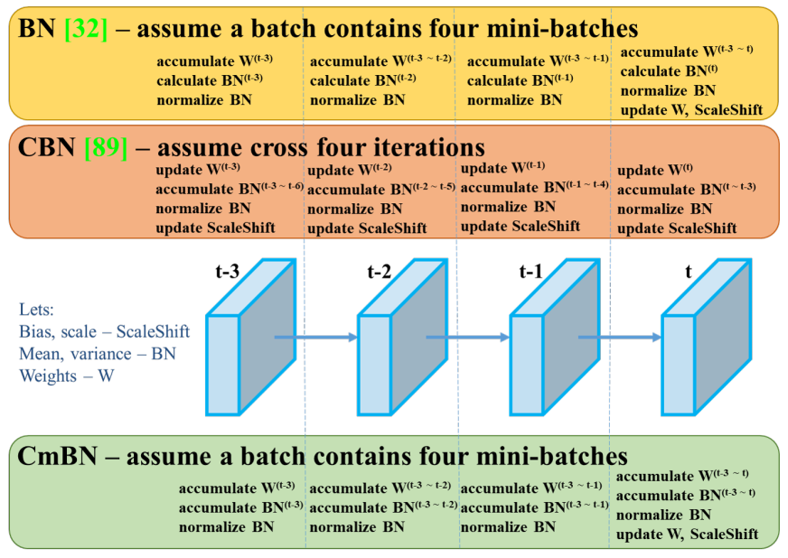
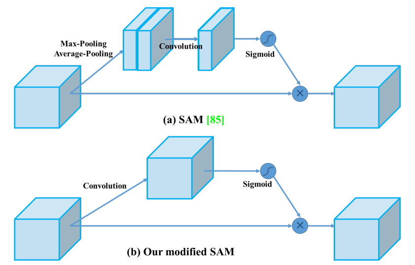
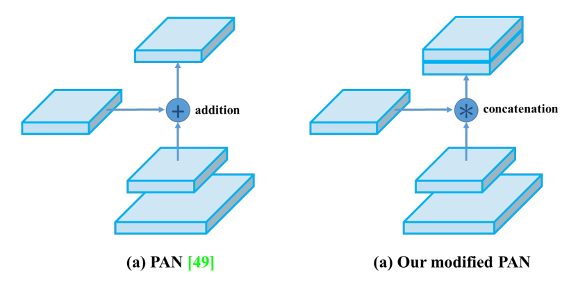

# YOLOv4: Optimal Speed and Accuracy of Object Detection

## Abstract

据说有大量功能可以提高卷积神经网络 (CNN) 的准确性。需要在大型数据集上对这些特征的组合进行实际测试，并对结果进行理论证明。某些功能专门针对某些模型和某些问题专门操作，或仅针对小规模数据集；而一些特性，例如批量归一化和残差连接，适用于大多数模型、任务和数据集。我们假设这些通用特征包括加权残差连接 (WRC)、跨阶段部分连接 (CSP)、交叉小批量标准化 (CmBN)、自我对抗训练 (SAT) 和 Mish 激活函数。我们使用新功能：WRC、CSP、CmBN、SAT、Mish 激活、Mosaic 数据增强、CmBN、DropBlock 正则化和 CIoU 损失，并结合其中一些实现最先进的结果：43.5% AP (65.7 % AP 50 ) 在 Tesla V100 上以 ∼65 FPS 的实时速度获取 MS COCO 数据集。源代码位于 https://github.com/AlexeyAB/darknet。

## 1. Introduction

大多数基于 CNN 的对象检测器在很大程度上仅适用于推荐系统。 例如，通过城市摄像机搜索空闲停车位是由检测速度慢但准确率高的准型执行的，而汽车碰撞警告则与检测速度快而精确率低模型有关。 提高实时对象检测器的精确率不仅可以将它们用于生成提示的推荐系统，还可以用于独立的流程管理和减少人工输入。 传统图形处理单元 (GPU) 上的实时对象检测器操作允许以可承受的价格大规模使用它们。 最准确的现代神经网络不是实时运行的，需要大量 GPU 来进行大批量的训练。 我们通过创建一个在传统 GPU 上实时运行的 CNN 来解决这些问题，并且训练只需要一个传统 GPU。

这项工作的主要目标是设计生产系统中目标检测器的快速运行速度和优化并行计算，而不是低计算量理论指标（BFLOP）。 我们希望设计的对象可以很容易地训练和使用。 例如，任何使用传统 GPU 进行训练和测试的人都可以实现实时、高质量和令人信服的目标检测结果，如图 1 所示为 YOLOv4 的结果。我们的贡献总结如下：

- 我们开发了一个高效而强大的对象检测模型。 它使每个人都可以使用 1080 Ti 或 2080 Ti GPU 来训练超快速和准确的物体检测器。

- 我们在检测器训练期间验证了最先进的 Bag-of-Freebies 和 Bag-of-Specials 方法的对象检测的影响。

- 我们修改了最先进的方法，使它们更有效，更适合单 GPU 训练，包括 CBN [89]、PAN [49]、SAM [85] 等。

## 2. Related work

### 2.1. Object detection models

现代检测器通常由两部分组成，一个在 ImageNet 上预训练的主干和一个用于预测对象的类别和边界框的头。对于那些在 GPU 平台上运行的检测器，它们的主干可以是 VGG [68]、ResNet [26]、ResNeXt [86] 或 DenseNet [30]。对于那些在 CPU 平台上运行的检测器，它们的主干可以是 SqueezeNet [31]、MobileNet [28、66、27、74] 或 ShuffleNet [97、53]。对于头部，通常分为两类，即一级目标检测器和二级目标检测器。最具代表性的两阶段目标检测器（有锚框）是 R-CNN [19] 系列，包括 fast R-CNN [18]、faster R-CNN [64]、R-FCN [9] 和 Libra R-CNN [58] 。也可以将两级对象检测器制作为**无锚框**对象检测器，例如 RepPoints [87]。对于一级目标检测器，最具代表性的模型是 YOLO [61、62、63]、SSD [50] 和 RetinaNet [45]。近年来，开发了**无锚框**的一级目标检测器。这类检测器有CenterNet [13]、CornerNet [37, 38]、FCOS [78]等。近年来开发的目标检测器经常在 backbone 和 head 之间插入一些层，这些层通常用于从不同的阶段收集特征图。我们可以称它为物体检测器的颈部。通常，一个颈部由几个自下而上的路径和几个自上而下的路径组成。配备这种机制的网络包括特征金字塔网络 (FPN) [44]、路径聚合网络 (PAN) [49]、BiFPN [77] 和 NAS-FPN [17]。除了上述模型，一些研究人员将重点放在直接构建新的主干网络（DetNet [43]、DetNAS [7]）或新的整体模型（SpineNet [12]、HitDetector [20]）来进行目标检测。

综上所述，一个普通的物体检测器由几部分组成：

- **Input**: Image, Patches, Image Pyramid
- **Backbones**: VGG16 [68], ResNet-50 [26], SpineNet [12], EfficientNet-B0/B7 [75], CSPResNeXt50 [81], CSPDarknet53 [81]
- **Neck**:
	- **Additional blocks**: SPP [25], ASPP [5], RFB [47], SAM [85]
	- **Path-aggregation blocks**: FPN [44], PAN [49], NAS-FPN [17], Fully-connected FPN, BiFPN [77], ASFF [48], SFAM [98]

- **Heads**:
	- **Dense Prediction** (one-stage):
		- RPN [64], SSD [50], YOLO [61], RetinaNet [45] (anchor based)
		- CornerNet [37], CenterNet [13], MatrixNet [60], FCOS [78] (anchor free)
	- **Sparse Prediction** (two-stage):
		- Faster R-CNN [64], R-FCN [9], Mask R-CNN [23] (anchor based)
		- RepPoints [87] (anchor free)

*Figure 2: Object detector.*

### 2.2. Bag of freebies

通常，传统的物体检测器是离线训练的。因此，研究人员总是喜欢利用这一优势，开发更好的训练方法，使目标检测器在不增加推理成本的情况下获得更好的精度。**我们将这些只会改变训练策略或只会增加训练成本的方法称为 “bag of freebies**” 。对象检测方法经常采用并符合 bag of freebies 定义的是**数据增强**。数据增强的目的是增加输入图像的可变性，使设计的目标检测模型对从不同环境获得的图像具有更高的鲁棒性。例如，光度失真和几何失真是两种常用的数据增强方法，它们绝对有利于目标检测任务。在处理光度失真时，我们调整图像的亮度、对比度、色调、饱和度和噪声。对于几何失真，我们添加了随机缩放、裁剪、翻转和旋转。

上面提到的数据增强方法都是逐像素调整，调整区域内的所有原始像素信息都被保留。此外，一些从事数据增强的研究人员将重点放在**模拟对象遮挡问题**上。他们在图像分类和目标检测方面取得了很好的效果。例如，random erase [100] 和 CutOut [11] 可以随机选择图像中的矩形区域，并填充随机或互补的零值。至于 hide-and-seek [69]和 grid mask [6]，它们随机或均匀地选择图像中的多个矩形区域并将它们替换为全零。如果将类似的概念应用于特征图，则有 DropOut [71]、DropConnect [80] 和 DropBlock [16] 方法。此外，一些研究人员提出了将**多张图像一起使用**来进行数据增强的方法。例如，MixUp [92] 使用两个图像以不同的系数比率相乘和叠加，然后用这些叠加的比率调整标签。对于CutMix [91]，它是将裁剪后的图像覆盖到其他图像的矩形区域，并根据混合区域的大小调整标签。除了上述方法外，**风格迁移 GAN [15]** 还用于数据增强，这样的使用可以有效地减少 CNN 学习到的纹理偏差。

与上面提出的各种方法不同，其他一些 bag of freebies 方法致力于解决数据集中的**语义分布可能存在偏差**的问题。在处理语义分布偏差问题时，一个非常重要的问题是不同类之间存在数据不平衡的问题，而这个问题往往通过在两级目标检测器中使用 hard negative example mining [72]或 online hard example mining [67]来解决。但是示例挖掘方法不适用于一级目标检测器，因为这种检测器属于密集预测架构。因此林等人 [45] 提出了 focal loss 来处理各个类之间存在的数据不平衡问题。另一个非常重要的问题是，很难用 one-hot 编码来表达不同类别之间的关联程度的关系。执行标记时经常使用这种表示方案。 [73] 中提出的标签平滑是将硬标签转换为软标签进行训练，可以使模型更加健壮。为了获得更好的软标签，Islam 等人 [33] 引入了**知识蒸馏**的概念来设计标签细化网络。

最后一个 bag of freebies 是边界框（BBox）回归的目标函数。传统的物体检测器通常使用均方误差（MSE）直接对 BBox 的中心点坐标和高宽进行回归，即$$\{x_{center} , y_{center} , w, h\}$$，或者左上点和右下点，即 $$\{x_{top\_left}, y_{top\_left}, x_{bottom\_right}, y_{bottom\_right} \}$$。对于 anchor-based 方法，就是估计对应的偏移量，例如 $$\{x_{center\_offset}, y_{center\_offset}, w_{offset}, h_{offset}\}$$ 和$${x_{top\_left\_offset}, y_{top\_left\_offset}, x_{bottom\_right\_offset}, y_{bottom\_right\_offset}}$$。但是，直接估计 BBox 每个点的坐标值，就是把这些点当作自变量，而实际上没有考虑对象本身的完整性。为了更好地处理这个问题，一些研究人员最近提出了 IoU loss [90]，它考虑了预测 BBox 区域和地面实况 BBox 区域的覆盖范围。 IoU loss计算过程会通过与 ground truth 执行 IoU 来触发 BBox 的四个坐标点的计算，然后将生成的结果连接成一个完整的代码。因为 IoU 是一种尺度不变的表示，它可以解决传统方法在计算 $$\{x,y,w,h\}$$ 的 $$l_1$$ 或 $$l_2$$ 损失时，损失会随着尺度而增加的问题。最近，一些研究人员不断改进 IoU loss。例如，GIoU loss [65] 是除了覆盖区域之外还包括对象的形状和方向。他们提出找到能够同时覆盖预测 BBox 和 ground truth BBox 的最小区域 BBox，并以此 BBox 作为分母来代替原来用于 IoU loss 的分母。至于 DIoU 损失 [99] ，它额外考虑了物体中心的距离，而 CIoU 损失 [99] 同时考虑了重叠区域、中心点之间的距离和纵横比。 CIoU 在 BBox 回归问题上可以达到更好的收敛速度和准确率。

### 2.3. Bag of specials

**对于那些只增加少量推理成本但可以显着提高物体检测精度的插件模块和后处理方法，我们称之为 “Bag of specials”**。 一般来说，这些插件模块是为了增强模型中的某些属性，比如扩大感受野，引入注意力机制，或者加强特征整合能力等，而后处理是一种筛选模型预测结果的方法。

可用于增强感受野的常见模块是 SPP [25]、ASPP [5] 和 RFB [47]。 SPP 模块起源于空间金字塔匹配（SPM）[39]，SPM 的原始方法是将特征图分割成几个 $$d \times d$$ 相等的块，其中 $$d$$ 可以是 $$\{1, 2, 3, ...\}$$，因此形成空间金字塔，然后提取 bag-of-word 特征。 SPP 将 SPM 集成到 CNN 中，使用 max-pooling 操作代替 bag-of-word 操作。由于 He 等人提出的 SPP 模块 [25] 将输出一维特征向量，在全卷积网络（FCN）中应用是不可行的。因此，在 YOLOv3 [63] 的设计中，Redmon 和 Farhadi 将 SPP 模块改进为 max-pooling 输出的串联，内核大小为 $$k \times k$$，其中 $$k = \{1, 5, 9, 13\}$$，步幅等于 1。在这种设计下，相对较大的 $$k \times k$$ max-pooling 有效地增加了骨干特征的感受野。在加入改进版的 SPP 模块后，YOLOv3-608 在 MS COCO 目标检测任务上将 $$AP_{50}$$ 提升了 $$2.7\%$$，代价是额外计算了 $$0.5\%$$ 。 ASPP [5] 模块和改进的 SPP 模块在操作上的区别主要在于原始 $$k \times k$$ 内核大小，最大池化步长等于 1 到几个 $$3 \times 3$$ 内核大小，扩张比等于 $$k$$，步幅等于在空洞卷积操作中为 1 。RFB 模块是利用 $$k \times k$$ 核的若干个空洞卷积，空洞率等于 $$k$$ ，stride 等于 1 ，以获得比 ASPP 更全面的空间覆盖。 RFB [47] 只需花费 $$7\%$$ 的额外推理时间即可将 MS COCO 上 SSD 的 $$AP_{50}$$ 增加 $$5.7\%$$ 。

物体检测中经常用到的注意力模块主要分为 channel-wise attention 和 point-wise attention，这两种注意力模型的代表分别是 Squeeze-and-Excitation（SE）[29] 和 Spatial Attention Module（SAM）[85]。 虽然 SE 模块可以在 ImageNet 图像分类任务中将 ResNet50 的能力提高 1% top-1 准确率，但代价是仅增加 2% 的计算量，但在 GPU 上通常会增加约 10% 的推理时间， 所以更适合用在移动设备上。 但是对于 SAM，它只需要支付 0.1% 的额外计算，就可以在 ImageNet 图像分类任务上将 ResNet50-SE 的 top-1 准确率提高 0.5%。 最重要的是，它根本不会影响 GPU 上的推理速度。

在特征集成方面，早期的做法是使用 skip connection [51] 或 hyper-column [22] 将低级物理特征集成到高级语义特征。 由于 FPN 等多尺度预测方法的流行，许多融合不同特征金字塔的轻量级模块被提出。 这类模块包括 SFAM [98]、ASFF [48] 和 BiFPN [77]。 SFAM 的主要思想是使用 SE 模块在多尺度级联特征图上执行通道级别的重新加权。 至于 ASFF，它使用 softmax 作为逐点级别的重新加权，然后添加不同尺度的特征图。 在 BiFPN 中，提出了多输入加权残差连接来执行 scale-wise level re-weighting，然后添加不同尺度的特征图。

在深度学习的研究中，有些人把重点放在寻找好的激活函数上。一个好的激活函数可以使梯度更有效地传播，同时不会造成太多额外的计算成本。 2010 年，Nair 和 Hinton [56] 提出 ReLU 来大幅解决传统 tanh 和 sigmoid 激活函数中经常遇到的梯度消失问题。随后，LReLU [54]、PReLU [24]、ReLU6 [28]、Scaled Exponential Linear Unit (SELU) [35]、Swish [59]、hard-Swish [27] 和Mish [55] 等，也被用于解决梯度消失问题，已经被提出。 LReLU 和 PReLU 的主要目的是解决输出小于零时 ReLU 的梯度为零的问题。至于 ReLU6 和 hard-Swish，它们是专门为量化网络设计的。对于神经网络的自归一化，提出了 SELU 激活函数来满足目标。需要注意的一点是 Swish 和 Mish 都是连续可微的激活函数。

基于深度学习的目标检测常用的后处理方法是 NMS，可以用来过滤那些对同一目标预测不好的BBox，只保留响应更高的候选 BBox。 NMS 试图改进的方式与优化目标函数的方法是一致的。 NMS 提出的原始方法没有考虑上下文信息，因此 Girshick 等人 [19] 在 R-CNN 中增加了分类置信度得分作为参考，并按照置信度得分的顺序，按照从高到低的顺序进行贪心 NMS。对于软 NMS [1]，它考虑了在 IoU 得分的贪婪 NMS 中，物体的遮挡可能导致置信度得分下降的问题。 DIoU NMS [99] 开发者的思路是在 soft NMS 的基础上，在 BBox 筛选过程中加入中心点距离的信息。值得一提的是，由于上述后处理方法都不是直接参考捕获的图像特征，因此后续开发无锚方法时不再需要后处理。

## 3. Methodology

基本目标是神经网络的快速运行速度在生产系统和并行计算的优化，而不是低计算量的理论指标（BFLOP）。 我们提出了两种实时神经网络选项：

- 对于 GPU，我们在卷积层中使用少量组 (1 - 8)：CSPResNeXt50 / CSPDarknet53
- 对于 VPU - 我们使用分组卷积，但我们重新避免使用 Squeeze-and-excitement (SE) 块
	- 具体包括以下模型：EfficientNet-lite / MixNet [76] / GhostNet [21] / Mo-bileNetV3

### 3.1. Selection of architecture

我们的目标是在输入网络分辨率、卷积层数、参数数（ $$filter size^2 * filters * channel / groups$$）和层输出数（filters）之间找到最佳平衡。 例如，我们的大量研究表明，在 ILSVRC2012（ImageNet）数据集 [10] 上的对象分类方面，CSPResNext50 比 CSPDarknet53 要好得多。 然而，相反，CSPDarknet53 在 MS COCO 数据集上的对象检测方面优于 CSPResNext50 [46]。

下一个目标是为不同的检测器级别选择额外的块来增加感受野和来自不同骨干级别的参数聚合的最佳方法：例如 FPN、PAN、ASFF、BiFPN。

对分类最优的参考模型并不总是对检测器最优。 与分类器相比，检测器需要以下内容：

- Higher input network size (resolution) —— 用于检测多个小尺寸物体
- More layers —— 更高的感受野来覆盖增加的输入网络规模
- More parameters —— 提高模型在单个图像中检测多个不同尺寸对象的能力

我们可以假设应该选择具有更大感受野大小（具有更大数量的卷积层 $$3 \times 3$$）和更多参数的模型作为主干。 表 1 显示了 CSPResNeXt50、CSPDarknet53 和 EfficientNet B3 的信息。 CSPResNext50 仅包含 16 个 $$3 \times 3$$ 卷积层、一个 $$425 \times 425$$ 感受野和 20.6 M 参数，而 CSPDarknet53 包含 29 个 $$3 \times 3$$ 卷积层、一个 $$725 \times 725$$ 感受野和 27.6 M 参数。 这一理论证明，连同我们的大量实验，表明 CSPDarknet53 神经网络是两者作为检测器主干的最佳模型。

不同大小的感受野的影响总结如下：

- Up to the object size —— 允许查看整个对象
- Up to network size —— 允许查看对象周围的上下文
- Exceeding the network size —— 增加图像点和最终激活之间的连接数

我们在 CSPDarknet53 上添加了 SPP 块，因为它显着增加了感受野，分离出最重要的上下文特征，并且几乎不会降低网络运行速度。 我们使用 PANet 作为不同检测器级别的不同主干级别的参数聚合方法，而不是 YOLOv3 中使用的 FPN。

最后，我们选择 CSPDarknet53 骨干网、SPP 附加模块、PANet 路径聚合颈部和 YOLOv3（anchor based）头作为 YOLOv4 的架构。

未来我们计划大幅扩展 Bag of Freebies（BoF）检测器的内容，理论上可以解决一些问题并提高检测器精度，并以实验的方式依次检查每个特征的影响。

我们不使用跨 GPU 批量标准化（CGBN 或 SyncBN）或昂贵的专用设备。 这允许任何人在传统图形处理器上重现我们最先进的结果，例如图形处理器 GTX 1080Ti 或 RTX 2080Ti 。

### 3.2. Selection of BoF and BoS

为了改进目标检测训练，CNN 通常使用以下方法：

- **Activations**: ReLU, leaky-ReLU, parametric-ReLU, ReLU6, SELU, Swish, or Mish
- **Bounding box regression loss**: MSE, IoU, GIoU, CIoU, DIoU
- **Data augmentation**: CutOut, MixUp, CutMix
- **Regularization method**: DropOut, DropPath [36], Spatial DropOut [79], or DropBlock
- **Normalization of the network activations by their mean and variance**: Batch Normalization (BN) [32], Cross-GPU Batch Normalization (CGBN or SyncBN) [93], Filter Response Normalization (FRN) [70], or Cross-Iteration Batch Normalization (CBN) [89]
- **Skip-connections**: Residual connections, Weighted residual connections, Multi-input weighted residual connections, or Cross stage partial connections (CSP)

至于训练激活函数，由于 PReLU 和 SELU 更难训练，而 ReLU6 是专门为量化网络设计的，因此我们将上述激活函数从候选列表中删除。 在正则化的方法上，发表 Drop-Block 的人已经将他们的方法与其他方法进行了详细的比较，他们的正则化方法收获颇丰。 因此，我们毫不犹豫地选择了 Drop-Block 作为我们的正则化方法。 至于归一化方法的选择，由于我们专注于只使用一个 GPU 的训练策略，所以没有考虑 syncBN。

### 3.3. Additional improvements

为了使设计的检测器更适合在单 GPU 上训练，我们做了如下额外的设计和改进：

- 我们介绍了一种新的数据增强方法 Mosaic 和 Self-Adversarial Training (SAT)
- 我们在应用遗传算法时选择最佳超参数
- 我们修改了一些现有的方法，使我们的设计适合高效的训练和检测 —— modified SAM, modified PAN, and Cross mini-Batch Normalization (CmBN)

Mosaic 代表了一种新的数据增强方法，它混合了 4 个训练图像。 因此混合了 4 个不同的上下文，而 CutMix 仅混合了 2 个输入图像。 这允许检测其正常上下文之外的对象。 此外，批量归一化从每层的 4 个不同图像计算激活统计信息。 这显着减少了对大型 mini-batch 的需求。

Self-Adversarial Training（SAT）也代表了一种新的数据增强技术，它在 2 个前向后向阶段中运行。 在第一阶段，神经网络改变原始图像而不是网络权重。 通过这种方式，神经网络对自身执行对抗性攻击，改变原始图像以创建图像上没有所需对象的欺骗。 在第二阶段，训练神经网络以正常方式检测修改后的图像上的对象。

CmBN 表示 CBN 的修改版本，如图 4 所示，定义为 Cross mini-Batch Normalization (CmBN)。 这仅在单个批次中的小批次之间收集统计信息。

*Figure 4: Cross mini-Batch Normalization.*

我们将 SAM 从空间注意修改为点注意，并将 PAN 的快捷连接替换为串联，分别如图 5 和图 6 所示。

*Figure 5: Modified SAM.*

*Figure 6: Modified PAN.*

### 3.4. YOLOv4

在本节中，我们将详细阐述 YOLOv4 的细节。

YOLOv4 包含:

- **Backbone**: CSPDarknet53 [81]
- **Neck**: SPP [25], PAN [49]
- **Head**: YOLOv3 [63]

YOLOv4 使用：

- **Bag of Freebies (BoF) for backbone**: CutMix and Mosaic data augmentation, DropBlock regularization, Class label smoothing
- **Bag of Specials (BoS) for backbone**: Mish activation, Cross-stage partial connections (CSP), Multi-input weighted residual connections (MiWRC)
- **Bag of Freebies (BoF) for detector**: CIoU-loss, CmBN, DropBlock regularization, Mosaic data augmentation, Self-Adversarial Training, Eliminate grid sensitivity, Using multiple anchors for a single ground truth, Cosine annealing scheduler [52], Optimal hyper-parameters, Random training shapes
- **Bag of Specials (BoS) for detector**: Mish activation, SPP-block, SAM-block, PAN path-aggregation block, DIoU-NMS

## 4. Experiments

我们测试了不同训练改进技术对 ImageNet (ILSVRC 2012 val) 数据集上分类器准确度的影响，然后测试了检测器在 MS COCO (test-dev 2017) 数据集上准确度的影响。

## 5. Results

与其他最先进的物体检测器获得的结果比较如图 8 所示。我们的 YOLOv4 位于帕累托最优曲线上，在速度和准确度方面都优于最快和最准确的检测器。

由于不同的方法使用不同架构的 GPU 进行推理时间验证，我们在常用的 Maxwell、Pascal 和 Volta 架构的 GPU 上运行 YOLOv4，并将它们与其他最先进的方法进行比较。 表 8 列出了使用 Maxwell GPU 的帧率对比结果，它可以是 GTX Titan X (Maxwell) 或 Tesla M40 GPU。 表 9 列出了使用 Pascal GPU 的帧率对比结果，它可以是 Titan X (Pascal)、Titan Xp、GTX 1080 Ti 或 Tesla P100 GPU。 表 10 列出了使用 Volta GPU 的帧率对比结果，可以是 Titan Volta 或 Tesla V100 GPU。

## 6. Conclusions

我们提供最先进的检测器，它比所有可用的替代检测器更快 (FPS) 且更准确（MS COCO $$AP_{50...95}$$ 和 $$AP_{50}$$ ）。 所描述的检测器可以在具有 8-16 GB-VRAM 的传统 GPU 上进行训练和使用，这使得其广泛使用成为可能。 一级锚点检测器的原始概念已经证明了它的可行性。 我们已经验证了大量的特征，并选择使用这些特征来提高分类器和检测器的准确性。 这些功能可以用作未来研究和开发的最佳实践。

